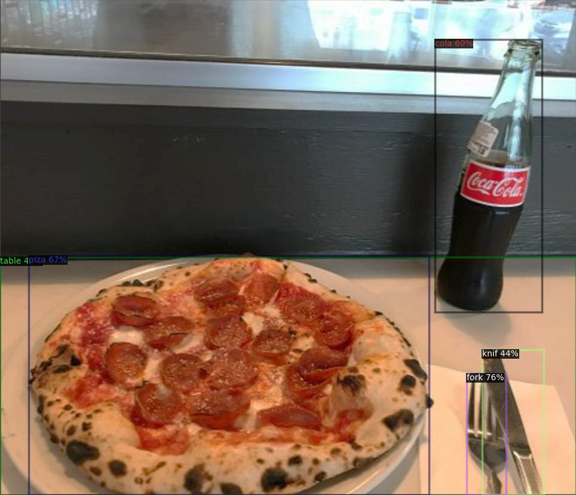
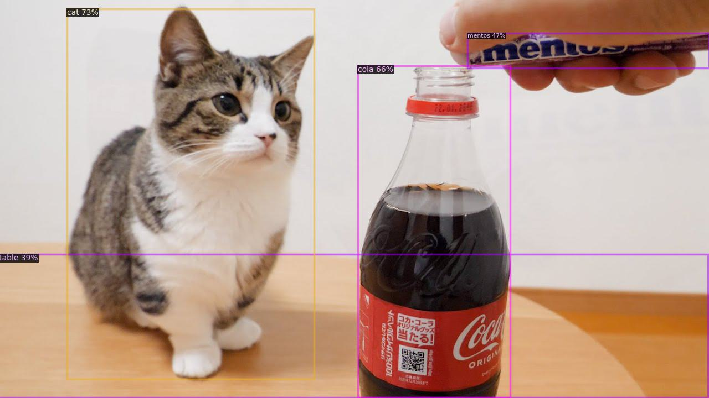
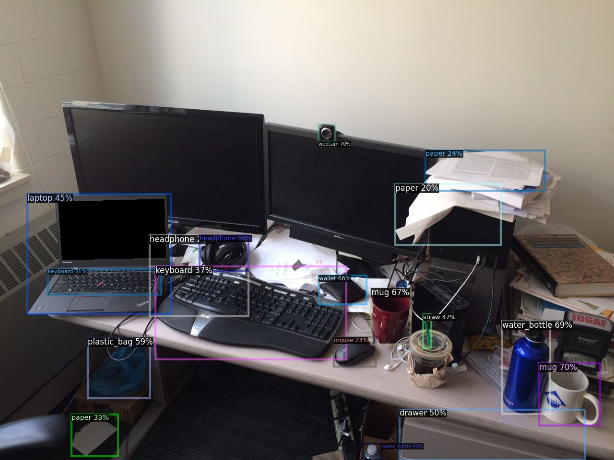
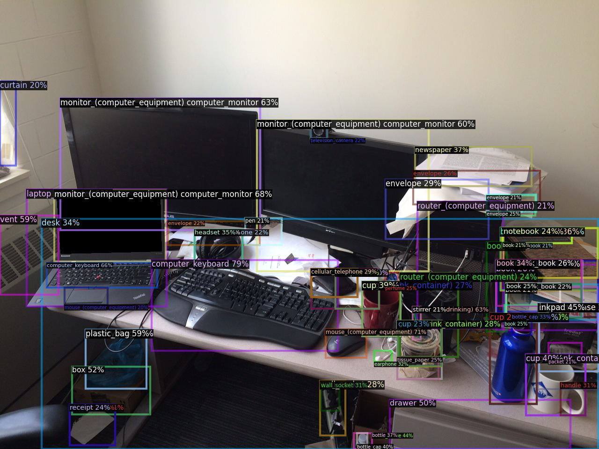
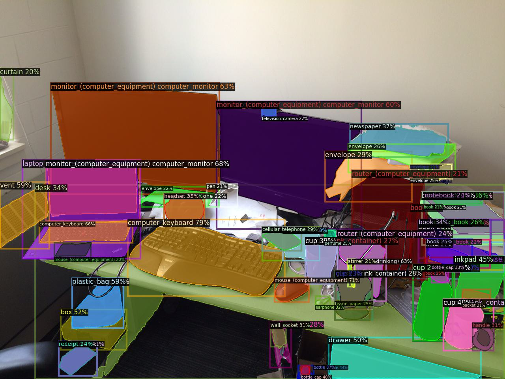

# Language-conditioned Detection Transformer 

<p align="center">  </p>

> [**Language-conditioned Detection Transformer**](https://arxiv.org/abs/2311.17902)  
> [Jang Hyun Cho](https://janghyuncho.github.io/) and [Philipp Kr&auml;henb&uuml;hl](https://www.philkr.net/)  
> *arXiv ([arXiv 2311.17902](https://arxiv.org/abs/2311.17902))*  

## What is DECOLA?
We design a new open-vocabulary detection framework that adjusts the *inner mechanism* of the object detector to the concepts it reasons over. 
This language-conditioned detector (**DECOLA**) trains as easily as classical detectors, but generalizes much better to novel concepts. 
DECOLA trains in three steps: (1) Learning to *condition* to a set of concept. (2) pseudo-labeling image-level data to scale-up training data. (3) learning general-purpose detector for downstream open-vocabulary detection. 
We show strong zero-shot performance in open-vocabulary and standard LVIS benchmarks. [[Full abstract](docs/ABSTRACT.md)]


***TL;DR: We design a special detector for pseudo-labeling and scale-up open-vocabulary detection through self-training.***

Please feel free to reach out for any questions or discussions! 

📧 Jang Hyun Cho [[email](janghyuncho7@utexas.edu)]


## 🔥 News 🔥
- Added zero-shot eval configs, and fixed some config and dependency issues. 
- Added missing configs and weights. 
- Metadata uploaded. 
- Integrate [Segment Anything Model](https://github.com/facebookresearch/segment-anything) (SAM) into DECOLA to generate high quality, open-vocabulary instance segmentation. ([Try out!](https://github.com/janghyuncho/DECOLA/tree/main#integrating-segment-anything-model))
- First commit.


## Features 
- Detection transformer that *adapts its inner-mechanism* to specific classes represented in language ([How?](https://github.com/janghyuncho/DECOLA/blob/main/docs/TRAINING.md#phase-1)).
- Highly accurate [self-labeling](https://github.com/janghyuncho/DECOLA/blob/main/docs/TRAINING.md#offline-self-labeling-and-training) to improve DETR as well as CenterNet2 and other detection frameworks. 
- State-of-the-art results on open-vocabulary LVIS (DETR and CenterNet2).
- Highly *box-efficient* object detector when language-conditioned ([analysis](docs/ANALYSIS.md)).


## Installation

See [installation instructions](docs/INSTALL.md).

## Demo

We provide demo based on [detectron2 demo interface](https://github.com/facebookresearch/detectron2/blob/main/GETTING_STARTED.md). 

- *DECOLA has Phase 1 as language-conditioned detector and Phase 2 as general-purpose detector. 
Use `--language-condition` flag to use the phase 1 DECOLA.*

- *For visualizing CenterNet2 models, use `--c2` flag.* 

- *To use Segment Anything Model for mask generation, use `--use-sam` flag.*

### DECOLA Phase 1: Language-conditioned detection.
First, please download appropriate [model checkpoint](docs/MODEL_ZOO.md). Then, you can run demo as following

```
python demo.py --config-file configs/DECOLA_PHASE1_L_CLIP_SwinB_4x.yaml --input figs/input/pizza.jpg --output figs/output/pizza.jpg --vocabulary custom --custom_vocabulary cola,piza,fork,knif,table --confidence-threshold 0.3 --language-condition --opts MODEL.WEIGHTS weights/DECOLA_PHASE1_L_CLIP_SwinB_4x.pth 
```
Above model is [DECOLA Phase 1](https://github.com/janghyuncho/DECOLA/blob/main/docs/TRAINING.md#phase-1) with Swin-B backbone ([config](configs/DECOLA_PHASE1_L_CLIP_SwinB_4x.yaml)), which has learned only from LVIS dataset. 
If setup properly, the output image should look like below:

<p align="center">  </p>

Note that `cola` is not in LVIS vocabulary as well as `piza` and `knif` have intended typos. Similarly, 

```
python demo.py --config-file configs/DECOLA_PHASE1_L_CLIP_SwinB_4x.yaml --input figs/input/cola.jpg --output figs/output/cola.jpg --vocabulary custom --custom_vocabulary cola,cat,mentos,table --confidence-threshold 0.3 --language-condition --opts MODEL.WEIGHTS weights/DECOLA_PHASE1_L_CLIP_SwinB_4x.pth 
```

<p align="center">  </p>

Above DECOLA predicts `mentos` and `cola` successfully, which are again outside LVIS vocabulary. 

### DECOLA Phase 2: General-purpose detection. 
General-purpose detection with Phase 2 of DECOLA is also available for both custom vocabulary

```
python demo.py --config-file configs/DECOLA_PHASE2_LI_CLIP_SwinB_4x_ft4x.yaml --input figs/input/desk.jpg --output figs/output/desk1.jpg --vocabulary custom --custom_vocabulary water_bottle,wallet,webcam,mug,headphone,drawer,keyboard,laptop,straw,mouse,paper,plastic_bag --confidence-threshold 0.2 --opts MODEL.WEIGHTS weights/DECOLA_PHASE2_LI_CLIP_SwinB_4x_ft4x.pth 
```

<p align="center">  </p>

and a pre-defined vocabulary (e.g., LVIS).

```
python demo.py --config-file configs/DECOLA_PHASE2_LI_CLIP_SwinB_4x_ft4x.yaml --input figs/input/desk.jpg --output figs/output/desk2.jpg --vocabulary lvis --confidence-threshold 0.2 --opts MODEL.WEIGHTS weights/DECOLA_PHASE2_LI_CLIP_SwinB_4x_ft4x.pth 
```
<p align="center">  </p>

### Integrating Segment Anything Model

We combine DECOLA's powerful language-conditioned, open-vocabulary detection and Segment Anything Model (SAM). DECOLA's box output prompts SAM to generate high-quality class-aware instance segmentation. Simply [install SAM](https://github.com/janghyuncho/DECOLA/blob/main/docs/INSTALL.md#optional-segment-anything-model-sam) and add `--use-sam` flag:

```
python demo.py --config-file configs/DECOLA_PHASE2_LI_CLIP_SwinB_4x_ft4x.yaml --input figs/input/desk.jpg --output figs/output_sam/desk2.jpg --vocabulary lvis --confidence-threshold 0.2 --use-sam --opts MODEL.WEIGHTS weights/DECOLA_PHASE2_LI_CLIP_SwinB_4x_ft4x.pth 
```
<p align="center">  </p>


*Image credit: [David Fouhey](https://web.eecs.umich.edu/~fouhey).*

## Training DECOLA  

Please [prepare datasets](docs/DATASETS.md) first, and follow [training scripts](docs/TRAINING.md) to reproduce our results. 

## Testing DECOLA

Check out for all the [checkpoints](docs/MODEL_ZOO.md) of our model as well as baselines. 

Here are the highlight results:

### Open-vocabulary LVIS with Deformable DETR

| name | backbone | box AP_novel | box mAP |
|:------|:-:|:-:|:-:|
| baseline | ResNet-50 | 9.4 | 32.2 | 
| + self-train    | ResNet-50 | 23.2 | 36.2 | 
| DECOLA (ours) | ResNet-50 | 27.6 | 38.3 | 
| baseline | Swin-B | 16.2 | 41.1 |
| + self-train    | Swin-B | 30.8 | 42.3 | 
| DECOLA (ours) | Swin-B | 35.7 | 46.3 | 
| baseline | Swin-L | 21.9 | 49.6 |
| + self-train    | Swin-L | 36.5 | 51.8 | 
| DECOLA (ours) | Swin-L | 46.9 | 55.2 |

### Direct zero-shot transfer to LVIS minival

| name | backbone  | data| AP_r | AP_c | AP_f | mAP |
|:------|:-:|:-:|:-:|:-:|:-:|:-:|
| DECOLA | Swin-T | O365, IN21K | 32.8 | 32.0 | 31.8 | 32.0 |
| DECOLA | Swin-L | O365, OID, IN21K | 41.5 | 38.0 | 34.9 | 36.8 |

### Direct zero-shot transfer to LVIS v1.0

| name | backbone  | data| AP_r | AP_c | AP_f | mAP |
|:------|:-:|:-:|:-:|:-:|:-:|:-:|
| DECOLA | Swin-T | O365, IN21K | 27.2 | 24.9 | 28.0 | 26.6 |
| DECOLA | Swin-L | O365, OID, IN21K |32.9 | 29.1 | 30.3 | 30.2 |

### Open-vocabulary LVIS with CenterNet2 

| name | backbone | box AP_novel | box mAP | mask AP_novel | mask mAP |
|:------|:-:|:-:|:-:|:-:|:-:|
| DECOLA  | ResNet-50 | 29.5 | 37.7 | 27.0 | 33.7 | 
| DECOLA  | Swin-B | 38.4 | 46.7 | 35.3 | 42.0 | 


### Standard LVIS with Deformable DETR

| name | backbone | box AP_rare | box mAP |
|:------|:-:|:-:|:-:|
| baseline | ResNet-50 | 26.3 | 35.6 | 
| + self-train    | ResNet-50 | 30.0 | 36.6| 
| DECOLA (ours) | ResNet-50 | 35.9 | 39.4 | 
| baseline | Swin-B | 38.3 | 44.5 |
| + self-train    | Swin-B | 42.0 | 45.2 | 
| DECOLA (ours) | Swin-B | 47.4 | 48.3 | 
| baseline | Swin-L | 49.3 | 54.4 |
| + self-train    | Swin-L | 48.7 | 53.4 | 
| DECOLA (ours) | Swin-L | 54.9 | 56.4 |


### Standard LVIS with CenterNet2 

| name | backbone | box AP_rare | box mAP | mask AP_rare | mask mAP |
|:------|:-:|:-:|:-:|:-:|:-:|
| DECOLA (ours) | ResNet-50 | 35.6 | 38.6 | 32.1 | 34.4 | 
| DECOLA (ours) | Swin-B | 47.6 | 48.5 | 43.7 | 43.6 | 

## Analyzing DECOLA 

Here we provide [code for analyses](docs/ANALYSIS.md) of our model as well as baselines. 


## License
The majority of DECOLA is licensed under the Apache 2.0 license.
However, this work largely builds off of [Detic](https://github.com/facebookresearch/Detic), [Deformable DETR](https://github.com/fundamentalvision/Deformable-DETR), and [Detectron2](https://github.com/facebookresearch/detectron2/). We also provide optional integration with [Segment Anything Model](https://github.com/facebookresearch/segment-anything).
Please refer to their original licenses for more details. 


## Citation

If you find this project useful for your research, please cite our paper using the following bibtex.

    @article{cho2023language,
      title={Language-conditioned Detection Transformer},
      author={Cho, Jang Hyun and Kr{\"a}henb{\"u}hl, Philipp},
      journal={arXiv preprint arXiv:2311.17902},
      year={2023}
      }
