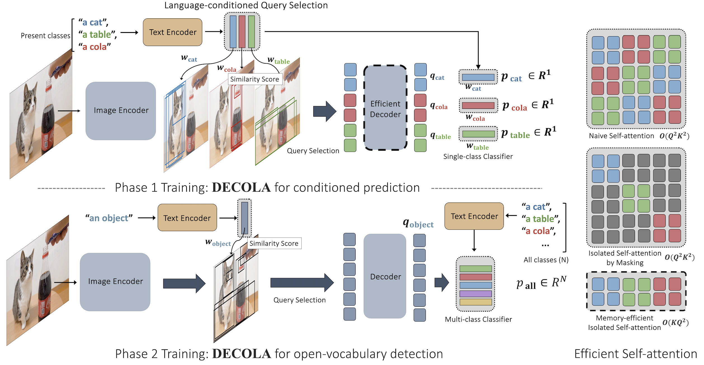

# Training **DECOLA**

<p align="center">  </p>

## Introduction
DECOLA training consists of phase 1 and phase 2. 
Phase 1 trains DECOLA for *language-conditioning* using available detection dataset.
Phase 2 extends DECOLA for *general-purpose open-vocabulary detection* using image-labeled dataset.

In general, one can train using the following command for [any model configuration](MODEL_ZOO.md).
```
python train_net.py --num-gpus 8 --config-file /path/to/config/name.yaml
```

### Weight & Biases
We provide [Weights & Biases](https://wandb.ai/site) setup for easy logging and visualization. After setting up, one can use it by adding `WANDB.DISABLE_WANDB False` in a command line. All W&B-related configuration can be found [here](https://github.com/janghyuncho/DECOLA/blob/main/decola/config.py#L173).   

## Phase 1: **DECOLA** for language-conditioning

### Highlights
- First-stage [language-conditioned query selection](https://github.com/janghyuncho/DECOLA/blob/main/decola/modeling/decola/decola_deformable_transformer.py#L122).

- Transformer decoder with [memory-efficient self-attention](https://github.com/janghyuncho/DECOLA/blob/main/decola/modeling/decola/decola_deformable_transformer.py#L314). 

- DECOLA [matching](https://github.com/janghyuncho/DECOLA/blob/main/decola/modeling/decola/decola_matcher.py) and [learning objective](https://github.com/janghyuncho/DECOLA/blob/main/decola/modeling/decola/decola_criterion.py) for language-conditioning.

- [Evaluate *conditioned*-mAP](https://github.com/janghyuncho/DECOLA/blob/main/decola/modeling/decola/d2_decola_deformable_detr.py#L370) after training.

### Training Command
Training Phase 1 of DECOLA on 8 GPUs with batch size 16 (2 per-gpu) on LVIS-base:

```
python train_net.py --num-gpus 8 --config-file DECOLA_PHASE1_Lbase_CLIP_R5021k_4x.yaml 
```
For standard LVIS, replace `Lbase` with `L`:
```
python train_net.py --num-gpus 8 --config-file DECOLA_PHASE1_L_CLIP_R5021k_4x.yaml 
```
Once training is complete, please move the model weight to `weights/` and change the file name to `config-name.pth` (e.g., `DECOLA_PHASE1_L_CLIP_R5021k_4x.pth`). 
All pre-trained models of Phase 1 DECOLA are [here](https://github.com/janghyuncho/DECOLA/blob/main/docs/MODEL_ZOO.md#decola-phase-1-on-conditioned-map-c-map). 


## Phase 2: **DECOLA** for general-purpose detector

### Highlights 
- [Self-labeling](https://github.com/janghyuncho/DECOLA/blob/main/decola/modeling/decola/d2_decola_deformable_detr.py#L304) from DECOLA conditioned on GT class names.

- First-stage [conditioning a object](https://github.com/janghyuncho/DECOLA/blob/main/decola/modeling/decola/decola_zero_shot_classifier.py#L43) for general-purpose object detection.

- Simple detection training with generated pseudo-labels either online or [offline](https://github.com/janghyuncho/DECOLA/blob/main/docs/TRAINING.md#offline-self-labeling-and-training).

### Training Command 
Training Phase 2 of DECOLA on 8 GPUs with batch size 16 (2 per-gpu) on LVIS-base and [ImageNet-LVIS](https://github.com/janghyuncho/DECOLA/blob/main/docs/DATASETS.md#imagenet-21k):
```
python train_net.py --num-gpus 8 --config-file DECOLA_PHASE2_Lbase_CLIP_R5021k_4x_ft4x.yaml MODEL.WEIGHTS weights/DECOLA_PHASE1_L_CLIP_R5021k_4x.pth
```
Above commands trains with pseudo-labels [generated online from a frozen DECOLA](https://github.com/janghyuncho/DECOLA/blob/main/decola/modeling/decola/d2_decola_deformable_detr.py#L304). All pre-trained models of Phase 2 DECOLA are [here](https://github.com/janghyuncho/DECOLA/blob/main/docs/MODEL_ZOO.md#open-vocabulary-lvis-with-deformable-detr).

#### Offline self-labeling and training 
Alternatively, one can preprocess pseudo-labels offline and train as standard supervised training:

```
for min_size in 240 280 320 360 400
do 
    python train_net.py --num-gpus 8 --config-file DECOLA_SELF_LABELING_Lbase_CLIP_R5021k_4x.yaml --eval-only MODEL.WEIGHTS weights/DECOLA_PHASE1_L_CLIP_R5021k_4x.pth INPUT.MIN_SIZE_TEST ${min_size} OUTPUT_DIR output/pseudo_labels/DECOLA_SELF_LABELING_Lbase_CLIP_R5021k_4x/
done
```
- *It takes about 10 hours to complete. If more resource is available, run it in parallel or change `TEST.BATCH_SIZE`.*

Above command generates pseudo-labels from a pre-trained phase 1 DECOLA with ResNet-50 backbone. In our experiment, we generate labels with different `min_size`. Then, use the following script to convert to annotation:

```
for min_size in 240 280 320 360 400 
do 
    python tools/convert_predictions_to_pseudo_annotations.py \
    --annotation_name imagenet_lvis_v1_decola_phase1_r50_21k_zeroshot_4x_minsize_${min_size} \
    --prediction_path output/pseudo_labels/DECOLA_SELF_LABELING_Lbase_CLIP_R5021k_4x/inference_imagenet_lvis_v1/lvis_instances_results.json
    echo "${size} done."
done
```

Finally, we combine all annotations with the following command:

```
python tools/make_multi_resolution_pseudo_annotations.py --sizes 240 280 320 360 400 --annotation_name imagenet_lvis_v1_decola_phase1_r50_21k_zeroshot_4x

python tools/deduplicate_pseudo_annotations.py --annotation_name imagenet_lvis_v1_decola_phase1_r50_21k_zeroshot_4x --ioiu_thres 0.9
```

Alternatively, we provide pre-computed pseudo-annotations from all of our models below. 

| config | pseudo-annotations | 
|:------|:-:|
| [DECOLA_PHASE1_Lbase_CLIP_R5021k_4x](../configs/DECOLA_PHASE1_Lbase_CLIP_R5021k_4x.yaml) | [download](https://utexas.box.com/shared/static/hgedqhl48gvpsspdnpjom5ihlmmsek71.json) |
| [DECOLA_PHASE1_Lbase_CLIP_SwinB_4x](../configs/DECOLA_PHASE1_Lbase_CLIP_SwinB_4x.yaml) | [download](https://utexas.box.com/shared/static/xt0nfki0qu6che3l4cb3spdq4u5i2ugq.json) |
| [DECOLA_PHASE1_L_CLIP_R5021k_4x](../configs/DECOLA_PHASE1_L_CLIP_R5021k_4x.yaml) | [download](https://utexas.box.com/shared/static/uijhijbo68qa5qdspo6m336gwit27c24.json) |
| [DECOLA_PHASE1_L_CLIP_SwinB_4x](../configs/DECOLA_PHASE1_L_CLIP_SwinB_4x.yaml) | [download](https://utexas.box.com/shared/static/kg98lg7a71ls35aykspsfwvg8xiy8txk.json) |

- *NOTE: Please change [dataset registration code](https://github.com/janghyuncho/DECOLA/blob/main/decola/data/datasets/imagenet.py#L19) to properly locate the produced annotation files.* 

Then, use the following command to train DECOLA Phase 2:

```
python train_net.py --num-gpus 8 --config-file DECOLA_PHASE2_Lbase_CLIP_R5021k_4x_OFFLINE_ft4x.yaml MODEL.WEIGHTS weights/DECOLA_PHASE1_L_CLIP_R5021k_4x.pth 
```
- *If Weights & Biases is setup, use `WANDB.VIS_PERIOD` to visualize the predictions and pseudo-labels (See [here](https://github.com/janghyuncho/DECOLA/blob/main/decola/modeling/decola/d2_decola_deformable_detr.py#L336)). For example, `WANDB.VIS_PERIOD 10000` will generate visualization every 10,000 iterations.*

For CenterNet2 models of DECOLA, use the following command:

```
python train_net.py --num-gpus 8 --config-file DECOLA_C2_LbaseI_CLIP_R5021k_640b64_ft4x+Detic.yaml MODEL.WEIGHTS weights/BoxSup-C2_Lbase_CLIP_R5021k_640b64_4x.pth
```
which uses the same pseudo-annotations generated as above. 


## Training Baselines 
Below is an example of baseline training code. We follow [Detic](https://github.com/facebookresearch/Detic) and train open-vocabulary Deformable DETR. 

### Highlights 
- Use [open-vocabulary classifier](https://github.com/janghyuncho/DECOLA/blob/main/decola/modeling/detic/d2_detic_deformable_detr.py#L260). 

- Fixing [first-stage encoder loss bug](https://github.com/janghyuncho/DECOLA/blob/main/decola/modeling/detic/d2_detic_deformable_detr.py#L244).

- Improved baseline: [dropout rate](https://github.com/janghyuncho/DECOLA/blob/main/configs/BoxSup-DeformDETR_L_CLIP_R5021k_4x.yaml#L18) and [look-forward-twice](https://github.com/janghyuncho/DECOLA/blob/main/configs/BoxSup-DeformDETR_L_CLIP_R5021k_4x.yaml#L17). 

- [ResNet](https://github.com/janghyuncho/DECOLA/blob/main/configs/BoxSup-DeformDETR_L_CLIP_R5021k_4x.yaml#L8) and [Swin](https://github.com/janghyuncho/DECOLA/blob/main/configs/BoxSup-DeformDETR_Lbase_CLIP_SwinB_4x.yaml#L6) backbones pretrained on ImageNet-21K.

### Training Commands

Baseline training on 8 GPUs with batch size 16 (2 per-gpu) on LVIS-base:
```
python train_net.py --num-gpus 8 --config-file BoxSup-DeformDETR_Lbase_CLIP_R5021k_4x.yaml 
```

Again, move the model weight to `weights/` folder after renaming the file as `BoxSup-DeformDETR_Lbase_CLIP_R5021k_4x.pth`. Detic training on 8 GPUs on LVIS-base and ImageNet-LVIS:

```
python train_net.py --num-gpus 8 --config-file Detic_DeformDETR_LbaseI_CLIP_R5021k_4x_ft4x.yaml MODEL.WEIGHTS weights/BoxSup-DeformDETR_Lbase_CLIP_R5021k_4x.pth
```

All pre-trained models of baselines and Detic are [here](https://github.com/janghyuncho/DECOLA/blob/main/docs/MODEL_ZOO.md#decola-model-zoo).